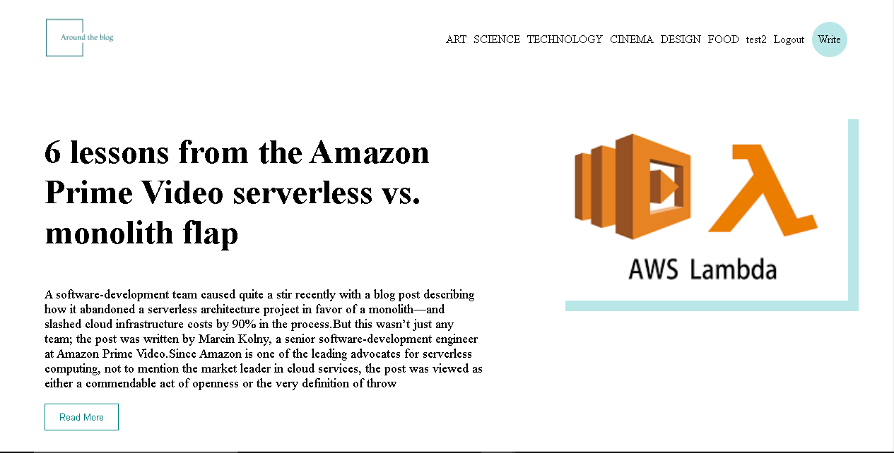
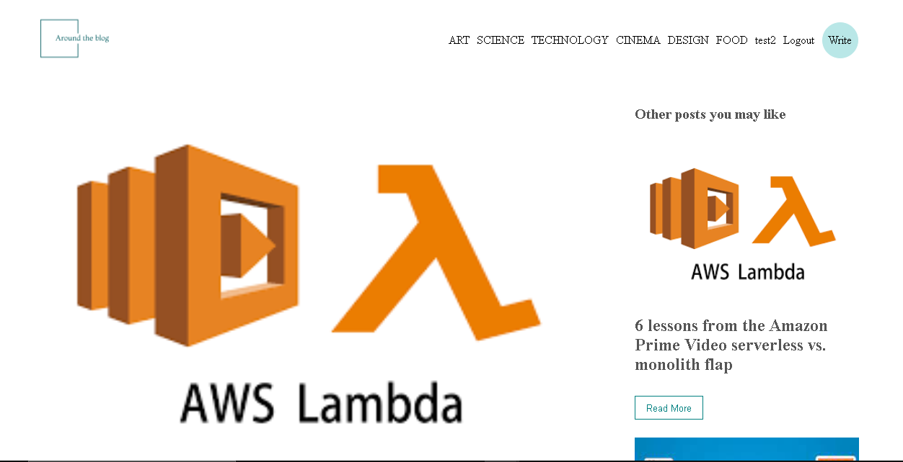
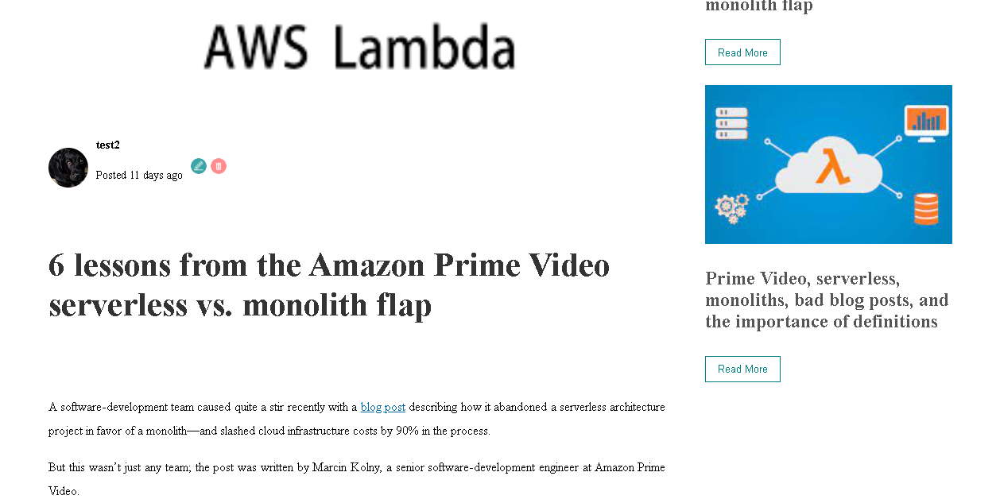
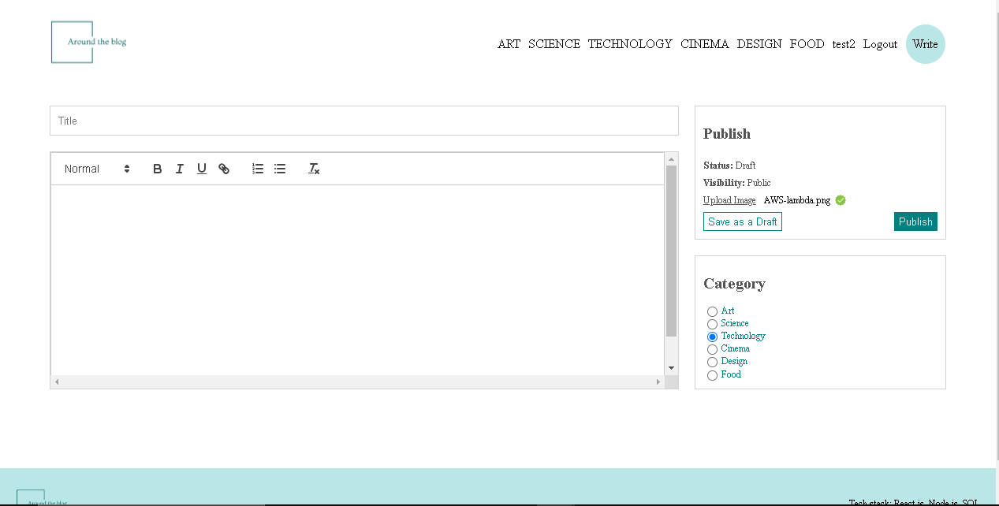

 

<h1 align="center">Blog Full Stack Web App</h1>

     <h4 align="center">This Blog Web App is designed for users interested in writing their own posts across six     
       categories, covering topics from food to technology.
     </h4> 
       

-----------------------------------------
### Overview
Our project aims at allowing users to play android games using only their speech. We will be using speech-to-text technology to achieve this task. First, the user will place a ‘pressure point’ that is, a point on the screen whose coordinates are saved by the app. When the player speaks
the word ‘porcupine’, a touch event will be executed at the pressure points location thus, making the game deal as if someone is playing with their fingers.
Our aim is to help specially-abled players, get an equally immersive experience as that of normal players. Also, we plan to release this app on the Google Playstore in the coming future to allow anyone with an android device to play.

-----------------------------------------

### Features

* User-friendly interface
* 6 Categories for easy navigation
* User authentication for secure posting
* Editing and deleting blogs by authorized users

-----------------------------------------

### Implementation
* Built with React for the front-end, utilizing Node.js for the server-side logic, and integrated with a MySQL database for data management.
* Created a dynamic Home page that aggregates and displays blog posts from all available categories.
* Implemented a user-friendly navigation system by incorporating individual category links in the navigation bar. Clicking on a category reveals related blog posts.
* Designed a Blog Writing page enabling users to compose and publish blogs within any of the six specified categories.
* Implemented a feature allowing users to click on individual blog posts for reading. Additionally, authorized users possess the capability to edit existing blogs for continuous refinement.

-----------------------------------------

### Screenshots
* `Home Page`
  

 

 

* `Single Post Page`
  

 
 

 

* `Write Post Page`
  

 

